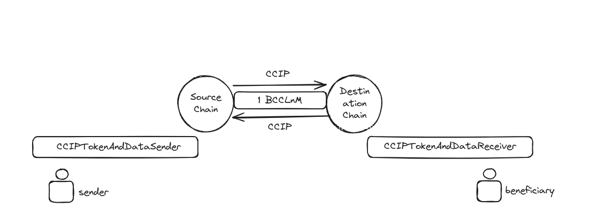

# LnM Custom Cross-Chain ERC20 TOKEN

<p align="center">

<br/>


A few days ago, I concluded my set of Masterclasses named [Crafting CCIP](https://github.com/Blockitus/crafting-ccip). The journey explains how the Chainlink Cross Chain Interoperability Protocol works and how we can build Cross-Chain Decentralized Apps (CC-DAPPS). These are the new types of DApps that will revolutionize the market by transferring value from one chain to another. Inspired by this, I had the idea 💡 to develop a simple Custom Cross-Chain ERC20 token. The distinctive feature of this token is that it enables the seamless flow of value between different chains.

To see all the documentation behind this example of the protocol, you can read my blog on [Medium]().
We are going to use this repository for implementation purposes.

A possible representation of what we aim to build is?

<p align="center">

<br/>

## Requirements

1. Blockchain and ERC20 knowledges
2. Solidity skills
3. CCIP skills
4. Foundry latest version installed
5. Nodejs latest version installed

## Quick Start

```bash
git clone https://github.com/Blockitus/lnmCCERC20.git
npm install 
forge install
```

Create .env file and fill the state variables with yours.

```bash
PRIVATE_KEY="YOUR_API_KEY"
POLYGON_MUMBAI_RPC_URL="YOUR_API_KEY"
AVALANCHE_FUJI_RPC_URL="YOUR_API_KEY"
```

## Running protocol

Below, you can find all the steps required to set up an environment in the land: PolygonMumbai-AvalancheFuji. The purpose is to demonstrate moving 1e18 BCCLnM tokens from Mumbai to Fuji. This process involves locking 1e18 BCCLnM into the LOCK_ADDRESS and, through CCIP, minting the same value onto the beneficiary on Fuji.

**Notice that we left our transactions and addresses to ensure our test is a successful process.**

### SOURCE CHAIN: Polygon Mumbai

Prepare

1. Deploy BCCLnM 
   1. AIRDROP_ADDRESS=`0x8d98929F87cd5169b30b1C0be585685bF8ba1198`
2. Deploy CCIPTokenAndDataSender
   1. ROUTER_ADDRESS: `0x1035CabC275068e0F4b745A29CEDf38E13aF41b1`
   2. LINKTOKEN_ADDRESS: `0x326C977E6efc84E512bB9C30f76E30c160eD06FB`
3. Fund **CCIPTokenAndDataSender** with:
   1. 1 LINK
   2. 1 BCCLnM
4. Whitelist the destination-chain-selector calling the `whitelistChain(uint64)` function:
   1. fuji-chain-selector: `14767482510784806043`


Run

```bash
forge create --rpc-url polygonMumbai --private-key=$PRIVATE_KEY src/BCCLnM.sol:BCCLnM --constructor-args <AIRDROP_ADDRESS>
```
**BCCLnM_ADDRESS=`0xdbF38F247C9981e14D79F3C73c98C737d0FA486b`**

```bash
forge create --rpc-url polygonMumbai --private-key=$PRIVATE_KEY src/CCIPTokenAndDataSender.sol:CCIPTokenAndDataSender --constructor-args <ROUTER_ADDRESS> <LINKTOKEN_ADDRESS>

```
**CCIPTOKEN_AND_DATA_SENDER_ADDRESS: `0xb92b74f8E02848e2538873584254FBeea9eEE52a`**

```bash
cast send 0x326C977E6efc84E512bB9C30f76E30c160eD06FB --rpc-url polygonMumbai --private-key=$PRIVATE_KEY "transfer(address,uint256)" <CCIPTOKEN_AND_DATA_SENDER_ADDRESS> 1000000000000000000
```

**TRX_HASH=`0xb71d6d99853f7ac3d7bc00d8a3035888e509759f95ca3161d03b87492ca5c182`**

```bash
cast send 0xdbF38F247C9981e14D79F3C73c98C737d0FA486b --rpc-url polygonMumbai --private-key=$PRIVATE_KEY "transfer(address,uint256)" <CCIPTOKEN_AND_DATA_SENDER_ADDRESS> 1000000000000000000
```
**TRX_HASH=`0xe7c22ed4b1d09d4ebd65a1db519781eb11a552c7edfe9dbf391c23243f865774`**


```bash
cast send <CCIPTOKEN_AND_DATA_SENDER_ADDRESS> --rpc-url polygonMumbai --private-key=$PRIVATE_KEY "whitelistChain(uint64)" 14767482510784806043
```

**TRX_HASH=`0x0b27226d6020edb35ca9271ad48d7d0567b15bbd5b590419e22fd32f6a42291e`**


### DESTINATION CHAIN: Avalanche Fuji

Prepare
1. Deploy CCIPTokenAndDataReceiver 
   1. ROUTER_ADDRESS_AT_FUJI: `0xF694E193200268f9a4868e4Aa017A0118C9a8177`
2. Save the CCIPTokenAndDataReceiver address
3. Extract the BCCLnM address
4. Whitelist the source-chain-selector calling the `whitelistChain(uint64)` function
   1. mumbai-chain-selector: `12532609583862916517`
5. Whitelist the sender calling the `whitelistSender(address)`. Notice, this argument (_sender) it is  the CCIPTokenAndDataSender address that we already have saved.
   1. sender_address:  `0x86E98245E42473469c6C9A553b331a869b4E492A`

Run

```bash
forge create --rpc-url avalancheFuji --private-key=$PRIVATE_KEY src/CCIPTokenAndDataReceiver.sol:CCIPTokenAndDataReceiver --constructor-args <ROUTER_ADDRESS_AT_FUJI> <AIRDROP_ADDRESS>
```

**CCIPTOKEN_AND_DATA_RECEIVER_ADDRESS=`0x24f7EDA7c8A14CddCd77AFe25E479d459aEdc626`**


```bash
cast send <CCIPTOKEN_AND_DATA_RECEIVER_ADDRESS> --rpc-url avalancheFuji --private-key=$PRIVATE_KEY "whitelistChain(uint64)" 12532609583862916517
```

**TRX_HASH:`0x67d3ec9dcfdfe62f2f90c6a5d3bc8d08b334dad5f17e4a236e1cfc63ae5ad549`**

```bash
cast send <CCIPTOKEN_AND_DATA_RECEIVER_ADDRESS> --rpc-url avalancheFuji --private-key=$PRIVATE_KEY "whitelistSender(address)" <CCIPTOKEN_AND_DATA_SENDER_ADDRESS>
```

**TRX_HASH: `0x5c988933000871f719999ee47bccca8fec77e6496f770873d4ac38e6cb6a9c28`**


### WRAP ALL

Prepare
1. Run `transferTokensPayLinkToken(uint64,address,address,address,uint256)` at Poolygon Mumbai source chain
   1. destinationChainSelector: `14767482510784806043`
   2. receiver: `<CCIPTokenAndDataReceiver_ADDRESS>
   3. beneiciary: `<BENEFICIARY_ADDRESS>
   4. token: <BCCLnM_ADDRESS_AT_SOURCE_CHAIN>
   5. amount: 1000`

Run

```bash
cast send <CCIPTOKEN_AND_DATA_SENDER_ADDRESS> --rpc-url polygonMumbai --private-key=$PRIVATE_KEY "transferTokensPayLinkToken(uint64,address,address,address,uint256)" 14767482510784806043 <CCIPTOKEN_AND_DATA_RECEIVER_ADDRESS> <BENEFICIARY_ADDRESS> <BCCLnM_ADDRESS_AT_SOURCE_CHAIN> 1000000000000000000
```

**TRX_HASH:`0xdf50bcea8452dabc7beb9e8e95d24476e16afa699242f5b292aacc713d12a0bc`**


Finally you can see the transaction in [CCIP EXPLORER](https://ccip.chain.link/msg/0xa1d318451e67942356cdaf9ae99cc83725c1fc5496fbaba8820c700f1edd2c8d)

## Conclusion

In conclusion, the completion of the "Crafting CCIP" Masterclasses has inspired the development of a unique Custom Cross-Chain ERC20 token, facilitating seamless value transfer across different chains. The provided documentation and implementation guide outline the process of deploying and interacting with the token on both the Polygon Mumbai and Avalanche Fuji chains, showcasing the practical application of the Chainlink Cross Chain Interoperability Protocol (CCIP). This project opens up new possibilities for decentralized applications, marking a significant step towards revolutionizing the blockchain market. For detailed instructions and code, refer to the [GitHub repository](https://github.com/Blockitus/lnmCCERC20) and [Medium blog](#).